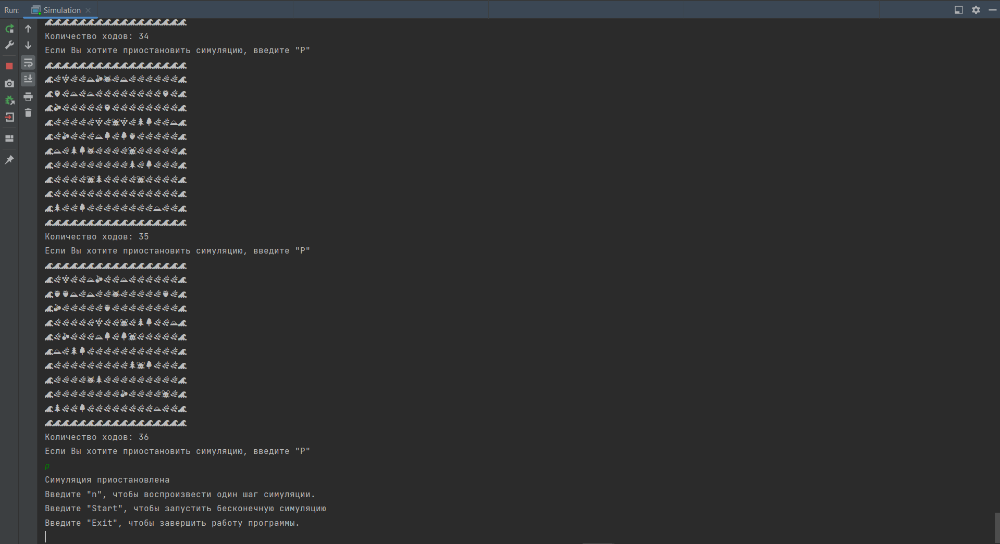

<h2>Проект "Симуляция"</h2>

ТЗ взято отсюда и немного изменено: https://zhukovsd.github.io/java-backend-learning-course/Projects/Simulation/

<h2>Цель проекта </h2>

Основная цель - демонстрация принципов дизайна архитектуры приложения с помощью ООП

<h2>Используемые технологии:</h2>
<ul>
<li>Java</li>
<li>ООП</li>
</ul>

<h2>Суть проекта</h2>

Данный проект - пошаговая симуляция 2D мира, населённого травоядными и хищниками. Кроме существ, мир содержит ресурсы (фрукты), которыми питаются травоядные, и статичные объекты, с которыми нельзя взаимодействовать - они просто занимают место.

2D мир представляет из себя матрицу NxM, каждое существо или объект занимают клетку целиком, нахождение в клетке нескольких объектов/существ - недопустимо.

Поиск пути осуществляется с помощью алгоритма "Поиск в ширину"

<h2>В программе присутствуют такие классы как:</h2>

<h3>Entity</h3>
Корневой абстрактный класс для всех существ и объектов существующих в симуляции.

<h3>Map</h3>
Карта, содержит в себе коллекцию для хранения существ и их расположения.

<h3>Simulation</h3>
Главный класс приложения, включает в себя такие методы как:
<ul>
<li>nextTurn() - просимулировать и отрендерить один ход</li>
<li>startSimulation() - запустить бесконечный цикл симуляции и рендеринга</li>
<li>pauseSimulation() - приостановить бесконечный цикл симуляции и рендеринга</li>
</ul>

<h3>Action</h3>
Класс содержит действия, совершаемые над миром. Например - сходить всеми существами. Это действие итерировало бы существ и вызывало каждому makeMove().
В данном классе есть следующие методы:
<ul>
<li>initActions() - действия, совершаемые перед стартом симуляции. Пример - расставить объекты и существ на карте</li>
<li>turnActions() - действия, совершаемые каждый ход. Примеры - передвижение существ, добавить травы или травоядных, если их осталось слишком мало</li>
</ul>

<h3>Fruit, Obstacle</h3>
Obstacle - статичные объекты (препятствия). Fruit - ресурс для травоядных.

<h3>Herbivore</h3>
Травоядное, наследуется от Creature. Стремятся найти ресурс (траву), может потратить свой ход на движение в сторону травы, либо на её поглощение.

<h3>Predator</h3>
Хищник, наследуется от Creature. В дополнение к полям класса Creature, имеет силу атаку. На что может потратить ход хищник:
Переместиться (чтобы приблизиться к жертве - травоядному)
Атаковать травоядное. При этом количество HP травоядного уменьшается на силу атаки хищника. Если значение HP жертвы опускается до 0, травоядное исчезает.